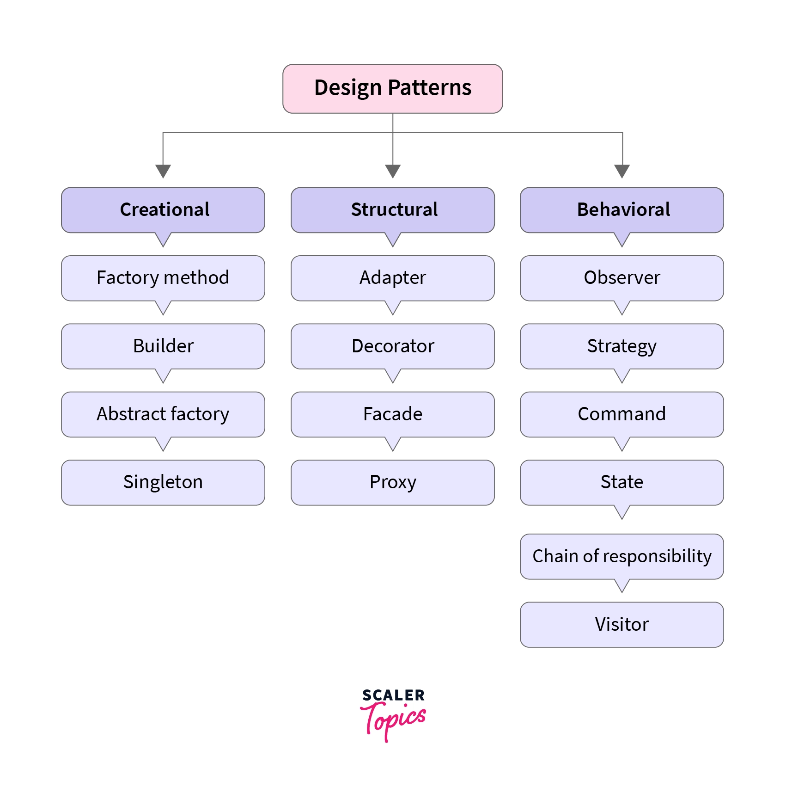
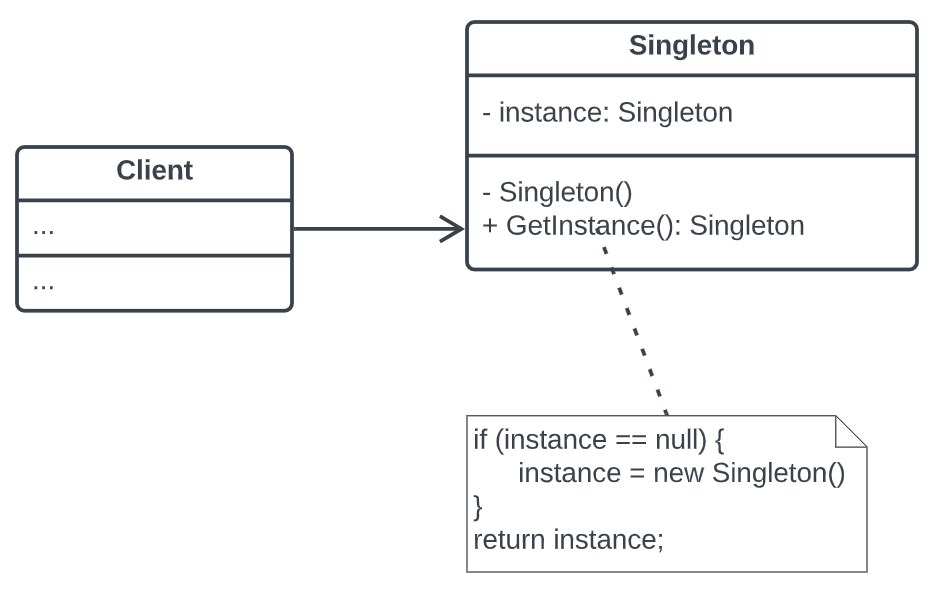
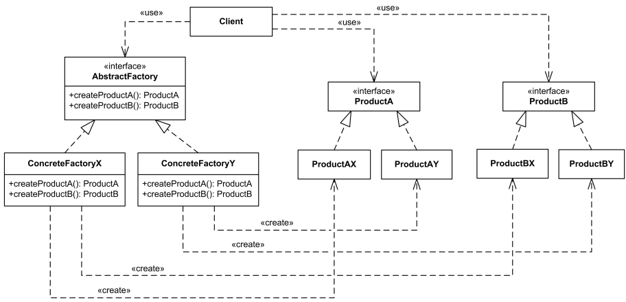
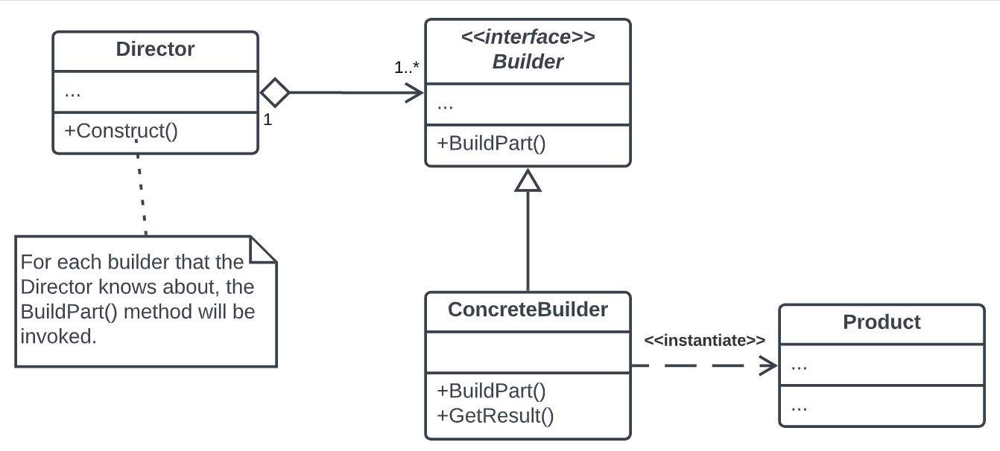

# Design Patterns with kotlin

## what's design patterns?
#### design patterns are typical solutions to commonly occurring problems in software design.

## What's GOF ?
#### GOF stands for gang of four
#### Gang of four is four authors Erich Gamma, Richard Helm, Ralph Johnson and John Vlissides published a book titled Design Patterns - Elements of Reusable Object-Oriented Software which initiated the concept of Design Pattern in Software development.

## Types of Design Patterns
<ol>
    <li> <a href="#creational"> Creational Patterns </a>
    </li>
    <li> <a href="#structural"> Structural Patterns <a/>
    </li>
    <li>  <a href="#Behavioral"> Behavioral Patterns <a/>
    </li>
    <li>J2EE Patterns    
    </li>
</ol>

## 
 Creational Patterns 

### Singleton Pattern 
is a creational design pattern that lets you ensure that a class has only one instance, while providing a global access point to this instance.

### Factory Method Pattern
a creational design pattern that provides an interface for creating objects in a superclass, but allows subclasses to alter the type of objects that will be created.

### Abstract Factory Pattern
is a creational design pattern that lets you produce families of related objects without specifying their concrete classes.

### Builder Pattern
is a creational design pattern that lets you construct complex objects step by step. The pattern allows you to produce different types and representations of an object using the same construction code.

<b>Director: </b> <i>notifies the builder whenever a part of the product should be built", which can be perfectly done by the client </i>

## 
 Structural Patterns 

### Proxy Pattern
a structural design pattern that lets you provide a substitute or placeholder for another object.

<b> Intent: </b>When we want to control access to an object.

### Facade pattern

a structural design pattern that provides a simplified interface to a library, a framework, or any other complex set of classes.

### Flyweight pattern

is a structural design pattern that lets you fit more objects into the available amount of RAM by sharing common parts of state between multiple objects instead of keeping all of the data in each object.

**Intrinsic Attributes** : attributes which do not change
**Extrinsic Attributes** : attributes which change in each initialization

### Decorator pattern

is a structural design pattern that lets you attach new behaviors to objects by placing these objects inside special wrapper objects that contain the behaviors.

## 
 Behavioral Patterns 

### Command pattern

a behavioral design pattern that allows encapsulating a request or an operation as an object.

- <B>Benefits of Command Pattern:</B>
1. Decoupling: It decouples the sender of a request from the receiver, providing loose coupling between the two.
2. Undo/Redo Functionality: It facilitates implementing undo and redo functionalities by storing command history.
3. Flexibility and Extensibility: New commands can be added without changing existing client or receiver code.

### Memento pattern (Snapshot)

is a behavioral design pattern that lets you save and restore the previous state of an object without revealing the details of its implementation.

<ol>
<li>
<B> Originator: </B> The Originator class can produce snapshots of its own state, as well as restore its state from snapshots when needed. [Player class]
</li>
<li>
<B> Memento: </B> The Memento is a value object that acts as a snapshot of the originator’s state. It’s a common practice to make the memento immutable and pass it the data only once, via the constructor [PlayerMemento class]
</li>
<li>
<B> CareTaker: </B> The Caretaker knows not only “when” and “why” to capture the originator’s state, but also when the state should be restored. A caretaker can keep track of the originator’s history by storing a stack of mementos. When the originator has to travel back in history, the caretaker fetches the topmost memento from the stack and passes it to the originator’s restoration method.
</li>

</ol>

### State Pattern

The State Design Pattern is a behavioral design pattern that allows an object to alter its behavior when its internal state changes. This pattern is useful when an object needs to change its behavior based on internal state changes without directly changing its class.

<ul>
    <li>
<B> Context: </B> It's the class that contains the state and delegates state-specific requests to the state classes. The context object maintains a reference to the current state object.
</li>
<li>
<B> State: </B> It's an interface or an abstract class that defines a set of methods that encapsulate the behavior associated with a particular state of the context.
</li>
<li>
<B> Concrete States: </B>These are the classes that implement the State interface. Each concrete state provides its own implementation of the behavior associated with the context's state.
</li>

</ul>

### Strategy Pattern

is a behavioral design pattern that lets you define a family of algorithms, put each of them into a separate class, and make their objects interchangeable at runtime.

### Visitor Pattern

is a behavioral design pattern that allows adding new behaviors to existing class hierarchy without altering any existing code.

**Structure of the Visitor Pattern**:

1. **Visitor Interface:** Defines a visit method for each concrete element type.
2. **Concrete Visitor:** Implements the Visitor interface and defines the operations to be performed on each element type.
3. **Element Interface:** Defines an accept method that takes a visitor as an argument.
4. **Concrete Element:** Implements the Element interface and provides the accept method implementation.
5. **Object Structure:** A collection or structure of elements that can accept a visitor.